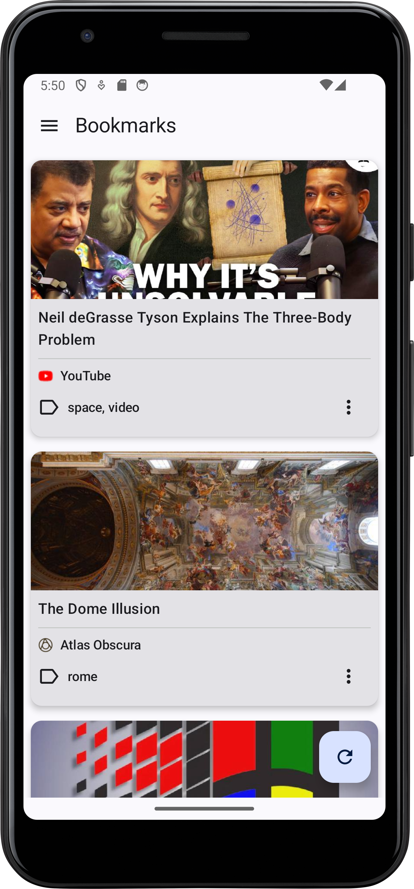
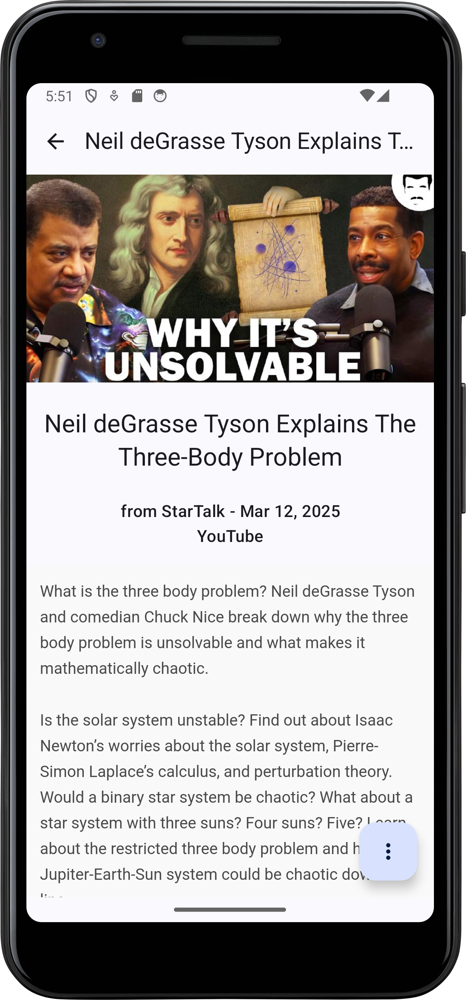

# Readeck App

## Overview

Readeck App is an Android application designed to help users manage and read their saved articles and bookmarks. Currently, the app supports reading and listing bookmarks.

This app is a companion to Readeck (https://readeck.org/en/), a self-hosted read-it-later service. To use this app, you'll need a Readeck account and server instance.

## Screenshots

## Tech Stack

This project uses the following technologies:

*   [Kotlin](https://kotlinlang.org/)
*   [Jetpack Compose](https://developer.android.com/jetpack/compose)
*   [Kotlin Coroutines](https://kotlinlang.org/docs/coroutines-overview.html)
*   [Jetpack Navigation](https://developer.android.com/jetpack/compose/navigation)
*   [Timber](https://github.com/JakeWharton/timber)
*   [Hilt](https://dagger.dev/hilt/) for dependency injection
*   [Retrofit](https://square.github.com/retrofit/) for network requests
*   [Room](https://developer.android.com/training/data-storage/room) for local data persistence
*   ...

## Installation

Right now, the easiest way to try out Readeck App is by downloading the APK file directly from our [GitHub Releases page](https://github.com/jensomato/ReadeckApp/releases).

Keep in mind that these are snapshot releases built from the `develop` branch. This means they might not be as stable as a final release, but they'll give you a sneak peek at the latest features and improvements.

## Roadmap

Here are some of the features planned for future releases:

*   ~~Offline access to saved content~~
*   Organizing content with labels and categories
*   Mark articles as read/unread
*   Archive/unarchive articles
*   Favorite articles
*   Add articles
*   ...

## License

This project is licensed under the [GNU General Public License v3.0](LICENSE). Some of the used libraries are released under different licenses.
